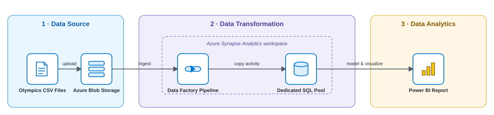

# Athlete Performance Tokyo Olympics with Azure Synapse Analytics

## Architecture

The pipeline runs in three phases: **Data Source** (Olympics CSV files uploaded to Azure Blob Storage), **Data Transformation** (a Data Factory pipeline, running inside the Azure Synapse Analytics workspace, copies that data into a Dedicated SQL Pool), and **Data Analytics** (Power BI connects to the SQL Pool to model and visualize it).

## Business Overview

Before platforms like Azure Synapse Analytics, organizations analyzing large, varied datasets ran into data silos, inadequate warehousing, and costly, complex processing. Synapse Analytics addresses this by unifying big-data processing and data warehousing into a single, pay-as-you-go cloud service, so an organization can move raw data through ingestion, storage, and transformation into ready-to-query tables without stitching together separate infrastructure.

## Aim

Build a data pipeline on Azure Synapse Analytics that ingests the 2021 Tokyo Olympics dataset from Blob Storage into a Synapse Dedicated SQL Pool, and visualize the results in Power BI. This project uses the Synapse **dedicated SQL pool**; a Spark pool variant of the same pipeline is a separate follow-up project.

## Dataset Description

Source: [`Data/`](Data/) — five CSV files covering more than 11,000 athletes across 47 sports and 743 teams at the Tokyo 2021 Olympics.

- **Athletes.csv** — `PersonName, Country, Discipline`
- **Coaches.csv** — `Name, Country, Discipline, Event`
- **EntriesGender.csv** — `Discipline, Female, Male, Total` (gender distribution per sport)
- **Medals.csv** — `Rank, Team_Country, Gold, Silver, Bronze, Total, Rank by Total`
- **Teams.csv** — `TeamName, Discipline, Country, Event`

The corresponding target schema for each file is defined in [`Code/DDL script.txt`](Code/DDL%20script.txt) — note that some CSV column names/order don't match the target table 1:1 (see [`CLAUDE.md`](CLAUDE.md) for the full mapping).

## Approach

1. Create an Azure Storage account and upload the CSV files into a container.
2. Create an Azure Synapse Analytics workspace.
3. Create a Dedicated SQL Pool inside the workspace.
4. Run the DDL script in Synapse Studio to create the five target tables (`AthletesOlympics`, `CoachesOlympics`, `AthletesGenderOlympics`, `CountryMedalsOlympics`, `TeamOlympics`).
5. Build a Data Factory pipeline in Synapse Studio with a Copy Data activity per file, mapping source columns to the destination table's columns, to ingest data from Blob Storage into the SQL pool tables.
6. Validate and run (debug) the pipeline; confirm each Copy Data activity succeeds and query the loaded tables.
7. Connect Power BI to the Synapse workspace's dedicated SQL pool (Get Data → Azure Synapse Analytics workspace) and load the five tables. 
8. Build visualizations (e.g. medals by country, athletes by gender per discipline) and publish the Power BI report. *(pending — see [Pending Work](#pending-work))*

## Tech Stack

- **Language:** T-SQL (DDL/table creation)
- **Services:** Azure Blob Storage, Azure Synapse Analytics (Data Factory pipelines + Dedicated SQL Pool), Power BI

## Key Learning Takeaways

- Traditional data vs. big data, and why Azure Synapse Analytics was built to unify big-data processing with data warehousing.
- The Synapse Analytics components (Data Factory, SQL pool, Spark pool, data lake, data catalog, workspace) and the tradeoffs between SQL pool and Spark pool.
- How to provision an Azure Storage account, Synapse workspace, and Dedicated SQL Pool from the Azure Portal.
- How to build, validate, and run a Synapse Data Factory pipeline to copy data from Blob Storage into SQL pool tables.

## Pending Work

- **Power BI visualization** — connecting Power BI to the Dedicated SQL Pool and building the report (Approach step 8) hasn't been done yet. To be updated soon.
